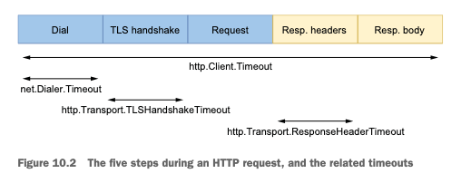
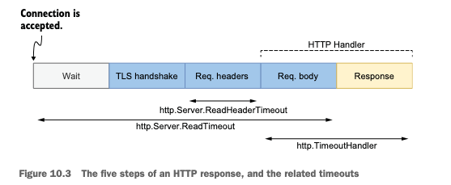
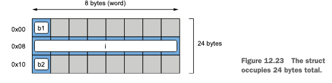
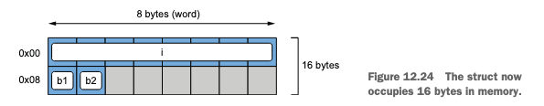

> 100 go mistakes


# 1. 代码和项目组织

## 1. 变量隐藏

当一个变量声明后，在之后使用 `:=` 配合多返回值进行重复声明并初始化，将导致非预想的结果。

示例：

```go
var tracing bool

func createClientWithTrace() (*http.Client, error) {
	return &http.Client{}, nil
}

func createClient() (*http.Client, error) {
	return &http.Client{}, nil
}

// bad
func example1() error {
	var client *http.Client
	if tracing {
		client, err := createClientWithTrace()
		if err != nil {
			return err
		}
		log.Println(">> example1 trace:", client != nil)
	} else {
		client, err := createClient()
		if err != nil {
			return err
		}
		log.Println(">> example1 no trace:", client != nil)
	}
	log.Println(">> example1 over:", client != nil)
	return nil
  // Output:
  // >> example1 no trace: true
  // >> example1 over: false
}

// good
func example2() error {
	var (
		client *http.Client
		err    error
	)
	if tracing {
		client, err = createClientWithTrace()
		if err != nil {
			return err
		}
		log.Println(">> example2 trace:", client != nil)
	} else {
		client, err = createClient()
		if err != nil {
			return err
		}
		log.Println(">> example2 no trace:", client != nil)
	}
	log.Println(">> example2 over:", client != nil)
	return nil
  // Output:
	// 2023/11/20 21:52:05 >> example2 no trace: true
	// 2023/11/20 21:52:05 >> example2 over: true
}
```

**建议：**Goland 编辑器对于被隐藏的变量，会特殊颜色标识，开发时注意即可。


## 2. 不必要的代码嵌套

**建议：**代码编写时多层 if/else ，可优化成尽早 return 减少代码嵌套层级。

```go
// bad
func join1(s1, s2 string, max int) (string, error) {
	if s1 == "" {
		return "", errors.New("s1 is empty")
	} else {
		if s2 == "" {
			return "", errors.New("s2 is empty")
		} else {
			concat, err := concatenate(s1, s2)
			if err != nil {
				return "", err
			} else {
				if len(concat) > max {
					return concat[:max], nil
				} else {
					return concat, nil
				}
			}
		}
	}
}

// good
func join2(s1, s2 string, max int) (string, error) {
	if s1 == "" {
		return "", errors.New("s1 is empty")
	}
	if s2 == "" {
		return "", errors.New("s2 is empty")
	}
	concat, err := concatenate(s1, s2)
	if err != nil {
		return "", err
	}
	if len(concat) > max {
		return concat[:max], nil
	}
	return concat, nil
}

func concatenate(s1, s2 string) (string, error) {
	return "", nil
}
```


## 3. 滥用init函数

Go 中可以通过 init() 函数执行初始化逻辑，Go 的相关初始化执行顺序为：

1. main 函数引入包的常量、变量初始化。
2. main 函数引入包的 init() 初始化。
3. main 函数的常量、变量初始化。
4. main 函数的 init() 初始化。

**问题：**

1. 复杂项目下，各个 init() 的执行顺序无法控制。

2. init() 是在编写的函数之前执行，是否有必要。
3. init() 要生效，需要在 main 函数中通过 `import _ xxx` 方式加入依赖。

**建议：**

1. 整个项目只定义一个 init() 函数，所有需要项目初始化运行的函数，添加到该 init() 函数中。
2. 在 main 函数加入定义 init() 函数包的依赖。


## 4. 过度使用getters和setters

建议：这个可能是使用 Java 的一些习惯，在使用 Go 的 channle 时直接操作无需定义 getters、setters 方法。


## 5. 接口污染

什么时候使用接口：

1. 共同的行为
2. 行为限制
3. 解耦

**建议：**

1. 不要扩展接口，而是组合接口（接口越大，抽象越弱）。
2. 发现接口，而不是定义接口。


## 6. 接口定义在生产者端

建议：接口定义在消费者端（使用者），而不是生产者端（提供者），这样一方面避免循环依赖问题，一方面避免消费者端实现它不需要的接口方法。


## 7. 返回接口

建议：

1. 大多数情况下，接收接口参数，返回接口实现参数（在你做的事情要保守，在接受别人的事情要开放）。
2. 特殊情况例如 io.Reader 定义了抽象约束，可返回接口。
3. 返回接口实现时，对 nil 判断需要注意，实现 error 接口的 nil 判断就有坑。


## 8. any意味nothing

建议：谨慎使用 any、interface 类型，使用时尽量添加代码注释，或采用泛型等方案解决。


## 9. 乱用泛型

Go 1.18 和之后版本，可以在代码中使用泛型，但使用泛型需考虑一些注意项。

建议：

1. 在 Go 泛型还未大规模使用时，谨慎使用泛型，使用它将会增加复杂度。
2. 确定要使用泛型时，需考虑是否可以这些类型有共同的行为，是否其类型范围是可确定的。


## 10. 乱用嵌入类型

使用嵌入类型可以将嵌入类型的方法提升，这样外部类型也可以使用嵌入类型方法，但此时无法控制哪些方法可导出哪些方法不可导出，同时当外部类型和嵌入类型有相同方法签名的方法，将给使用者带来困惑。

建议：对于只有一两个简单方法的嵌入类型，可以尝试使用嵌入类型，其他大部分场景不建议使用嵌入类型。


## 11. 不要使用option模式

当我们初始化一个 DB、Client 实例时，有很多配置参数可以进行自定义，这时有 3 种思路来初始化：

* 定义单独的 Config 结构体，初始化函数接收必须参数和可选参数 Config。
* 使用 builder 模式，通过链式调用方式配置参数。
* 使用 option 模式，定义配置可选参数的 option 函数，初始化时传递 option 函数。

建议：对于 option 模式的使用见仁见智，可根据具体情况使用，同时通过代码模块抽象方法，后期可方便修改重构。


## 12. 项目无组织

建议：https://github.com/golang-standards/project-layout 项目定义了 Go 的标准项目结构，但它并非官方标准，只要在项目中有良好的组织结构，无需太关注是否满足该标准，只作为参考即可。


## 13. 创建实用工具包

建议：不要直接讲工具方法定义在 utils、common 这样的通用的无法分辨其类型的包中，而应放在指向具体类型或标识具体功能的包中。


## 14. 忽略包命名冲突

建议：在定义变量名时，要避免与包名称冲突。


## 15. 缺少代码文档

建议：作者建议每个导出对象都应该有代码文档，但实际开发还是根据具体情况来，对于复杂的抽象程度不够的模块，建议添加代码文档。


## 16. 不适用linter

建议：编辑器默认开启 gofmt、goimports，每次代码提交时执行 golangci-lint 代码检查。


# 2. 数据类型

## 17. 八进制字面量造成混淆

示例：

```go
func main() {
	sum := 100 + 010
	fmt.Println(sum) // 108

	// 二进制
	n1 := 0b10
	fmt.Println(n1) // 2

	// 八进制
	n2 := 010
	fmt.Println(n2) // 8

	// 十六进制
	n3 := 0x10
	fmt.Println(n3) // 16
}
```

建议：编码时对于数字类型，注意区分各种进制数字。


## 18. 忽视整型溢出

建议：Go 在处理整型计算时，溢出是默认无法在编译期发现，编写代码时需要注意。


## 19. 不了解浮点数

建议：对于浮点数的计算需要注意。


## 20. 不理解切片的长度和容量

切片（slice）的长度（len）指切片的元素个数，容量（cap）指底层数组的元素个数，当容量不够时切片将进行扩容。

建议：使用切片时注意即可。


## 21. 低效的切片初始化

建议：slice 初始化时可根据实际情况定义长度或容量来优化，这样可避免 slice 频繁扩容。经测试在某些场景下同样的 slice 初始化逻辑，执行耗时优化前是优化后的 6 倍。


## 22. 对nil和空切片的困惑

nil 和空切片：

1. len、cap 都为 0，append 效果是一致的。
2. == nil 判断，nil 为 true，空切片为 false。
3. json 序列化时，nil 是 null，空切片是 []。

建议：不管是 nil 还是空切片，都使用 len 判断是否空，对于需要 json 序列化时，需要注意使用 nil 还是空切片。


## 23. 没有正确判断切片为空

建议：不管是 nil 还是空切片，都使用 len(s) == 0 判断是否空。


## 24. 没有正确拷贝切片

调用切片拷贝 copy 函数，要注意两点：1）第一个参数为目标切片，第二个参数为源切片；2）目标切片尽量和源切片长度保持一致（前者长度后者将只拷贝部分数据，前者长度大于后者将导致目标切片末尾出现多个空元素数据）。

建议：基于源切片的长度创建目标切片，正确调用 copy 函数。


## 25. 切片append的副作用

对源切片的子切片进行 append 等操作时会影响源切片，由于源切片和子切片共享底层数组。

建议：求切片的子切片场景需要注意，尽量采用 copy 方式拷贝子切片。


## 26. 切片内存泄露

直接在源切片通过 [m:n] 方式得到的子切片，和源切片共享底层数组，此时如果子切片没有被回收，源切片也不会被回收。

示例：

```go

func TestSliceMemoryLeak(t *testing.T) {
	printAlloc()

	s1 := make([]byte, 1024*1024)
	printAlloc()

	s2 := keepFirstTwoElementsOnly(s1)
	runtime.GC()
	printAlloc()
	runtime.KeepAlive(s2)

	// Output:
	// 142 KB
	// 1166 KB
	// 1163 KB
}

func TestSliceMemoryLeakCopy(t *testing.T) {
	printAlloc()

	s1 := make([]byte, 1024*1024)
	printAlloc()

	s2 := keepFirstTwoElementsOnlyCopy(s1)
	runtime.GC()
	printAlloc()
	runtime.KeepAlive(s2)

	// Output:
	// 143 KB
	// 1167 KB
	// 140 KB
}

func keepFirstTwoElementsOnly(s []byte) []byte {
	return s[:5]
}

func keepFirstTwoElementsOnlyCopy(s []byte) []byte {
	dst := make([]byte, 5)
	copy(dst, s)
	return dst
}

func printAlloc() {
	var m runtime.MemStats
	runtime.ReadMemStats(&m)
	fmt.Printf("%d KB\n", m.Alloc/1024)
}
```

建议：对切片求子切片时都使用 copy 方式，除非源切片和子切片都只是作为函数局部变量使用时可使用 [m:n] 方式。


## 27. 低效的map初始化

make(map[k]v, size) 方式初始化 map，区别于 slice，size 只是 map 的容量。

建议：在可预知 map 未来容量情况下，初始化时定义一个合适的 size，这样可避免 map 频繁扩容。


## 28. map内存泄露

Go 的 map 实现是基于 hmap -> buckets -> bmap 的数组加数组，扩容时 bucket 桶的数量也会进行扩容，但是删除元素时桶的数量不会缩容。并且当 map 的键或值小于等于 128 字节时，是直接存储在桶中，大于 128 字节则是存储指向键或值的指针。

建议：注意使用 map 存储大量元素场景，删除元素不会进行缩容，可能导致内存泄露。解决办法包括：

1. 定时迁移数据至新的 map，然后销毁旧 map（比较麻烦不建议）。
2. map 的键或值为复杂结构体时，以指针方式存储而不是直接存储。


## 29. 错误的比较

在使用 map 时，键必须是可比较的类型。在 Go 语言中布尔、数字、字符串、指针、通道、接口类型、还有包含这些类型的结构体或数组是可比较的，而 slice、map 和 function 则不可比较的。

建议：

1. 对于基础类型可直接使用 == 进行比较。

2. 对于 slice 或包含 slice 的 struct 等不可比较类型，可以使用 runtime.DeepEqual() 进行比较，但还是建议根据实际情况使用，或编写单独的比较函数。
3. Go 新版本提供了 comparable 类型，可参考使用。


# 3. 控制结构

## 30. 忽视循环遍历中元素复制

使用 `for i/k v := range` 遍历数组、切片、map等等的元素时，v 只是元素值的复制，对其修改不会影响源数据。要想修改元素可使用以下两种方式：1）通过索引 i 修改；2）定义值为指针进行修改。

建议：理解 Go 在遍历时值只是元素复制的设计。


## 31. 忽视循环遍历中参数计算

在循环遍历切片时，对切片进行添加和删除元素会导致非预期的结果。

示例：

```go
func main() {
	{
		// 无限循环
		s1 := []int{0, 1, 2}
		for range s1 {
			s1 = append(s1, 10)
		}
	}

	{
		// 无限循环
		s2 := []int{0, 1, 2}
		for i := 0; i < len(s2); i++ {
			s2 = append(s2, 10)
		}
	}
}
```

建议：避免在遍历切片时，对切片添加或删除元素操作，因为此时切片的长度是动态变化的。


## 32. 忽视遍历指针元素的影响

在遍历切片时， `for i v := range`  的 v 是遍历元素的值拷贝，如果需要对元素值取指针操作，不能对 v 进行取指针操作（此时），而应通过索引 i 取出元素值再进行取指针操作。

示例：

```go
func TestRangeLoopPointers(t *testing.T) {
	{
		// bad
		m := make(map[int]*int)
		s := []int{1, 2, 3}
		for _, v := range s {
			m[v] = &v
		}
		for k, v := range m {
			fmt.Println(">> range map-1:", k, *v)
		}
	}

	{
		// good
		m := make(map[int]*int)
		s := []int{1, 2, 3}
		for i := range s {
			m[s[i]] = &s[i]
		}
		for k, v := range m {
			fmt.Println(">> range map-2:", k, *v)
		}
	}

	// Output:
	// >> range map-1: 3 3
	// >> range map-1: 1 3
	// >> range map-1: 2 3
	// >> range map-2: 1 1
	// >> range map-2: 2 2
	// >> range map-2: 3 3
}
```

建议：range 循环遍历时，主要指针元素操作。


## 33. 对map遍历错误的假设

建议：

1. map 每次遍历是无序的，注意不能做有序遍历假设。
2. 不要在 map 遍历时对 map 做插入操作，否则结果是不可预知的（因为 map 遍历是无序的）。


## 34. 忽视break的工作机制

在 for 循环中可以通过 break 机制退出循环，但是当 for 循环嵌套 switch、select 时，在 switch、select 的 break 语句，只作用在 switch、select 中，不会退出外层的 for 循环。

建议：在 for 循环中注意内嵌 switch、select 循环场景，此时内嵌循环中的 break 不会退出外层 for 循环，可以使用 loop 或 return 来退出整个 for 循环。


## 35. 在循环中使用defer

defer 用于延迟函数调用，但是在 for 循环中调用 defer，有个问题就是所有循环迭代的 defer 语句是最后一起执行的。

解决办法就是将 for 循环逻辑抽象为一个独立的函数。

示例：

```go

func main() {
	example1()

	log.Println("----------------------")

	example2()

	// Output:
	// 2023/11/24 19:55:01 >> range: 0
	// 2023/11/24 19:55:02 >> range: 1
	// 2023/11/24 19:55:03 >> range: 2
	// 2023/11/24 19:55:04 >> defer: 2
	// 2023/11/24 19:55:04 >> defer: 1
	// 2023/11/24 19:55:04 >> defer: 0
	// 2023/11/24 19:55:04 ----------------------
	// 2023/11/24 19:55:04 >> range: 0
	// 2023/11/24 19:55:05 >> defer: 0
	// 2023/11/24 19:55:05 >> range: 1
	// 2023/11/24 19:55:06 >> defer: 1
	// 2023/11/24 19:55:06 >> range: 2
	// 2023/11/24 19:55:07 >> defer: 2
}

// bad
func example1() {
	for i := 0; i < 3; i++ {
		v := i
		defer log.Println(">> defer:", v)
		log.Println(">> range:", v)
		time.Sleep(time.Second)
	}
}

// good
func example2() {
	for i := 0; i < 3; i++ {
		v := i
		handle(v)
	}
}

func handle(v int) {
	defer log.Println(">> defer:", v)
	log.Println(">> range:", v)
	time.Sleep(time.Second)
}
```

建议：禁止在在 for 循环直接使用 defer 语句，而应将相关逻辑抽象为单独的函数，将 defer 语句添加到该函数中。


# 4. 字符串

## 36. 不理解rune

在 Go 中 byte 表示字节，rune 表示字符，注意求字节长度和字符长度区别。两者底层是：

```go
type byte = uint8
type rune = int32
```

示例：

```go
// type byte = uint8
// type rune = int32
func main() {
	s1 := "hello"
	fmt.Println(len(s1), len([]rune(s1)), utf8.RuneCountInString(s1))

	s2 := "好"
	fmt.Println(len(s2), len([]rune(s2)), utf8.RuneCountInString(s2))

	s3 := "tom"
	for i, v := range s3 {
		fmt.Printf("%d, %c\n", i, v)
	}

	s4 := "你好"
	for i, v := range s4 {
		fmt.Printf("%d, %c\n", i, v)
	}

	// Output:
	// 5 5 5
	// 3 1 1
	// 0, t
	// 1, o
	// 2, m
	// 0, 你
	// 3, 好
}
```

建议：

1. 求字符串字节长度，使用 `len` 函数。
2. 求字符串字符长度，使用 `len([]rune(s))` 或 `utf8.RuneCountInString(s)`  。


## 37. 字符串遍历

字符串 for 循环遍历，索引 i  是字节位置，值 v 是字符 rune。

示例：

```go
func main() {
	s1 := "tom"
	for i, v := range s1 {
		fmt.Printf("%d, %c\n", i, v)
	}
	fmt.Println("-------------------")
	for i, v := range []rune(s1) {
		fmt.Printf("%d, %c\n", i, v)
	}
	fmt.Println("-------------------")

	s2 := "你好"
	for i, v := range s2 {
		fmt.Printf("%d, %c\n", i, v)
	}
	fmt.Println("-------------------")
	for i, v := range []rune(s2) {
		fmt.Printf("%d, %c\n", i, v)
	}
	fmt.Println("-------------------")

	// Output:
	// 0, t
	// 1, o
	// 2, m
	// -------------------
	// 0, t
	// 1, o
	// 2, m
	// -------------------
	// 0, 你
	// 3, 好
	// -------------------
	// 0, 你
	// 1, 好
	// -------------------
}
```

建议：

1. 需要索引位置，将字符串转为 rune 切片进行遍历。
2. 无需索引位置，直接 `for _, v := range` 进行遍历。


## 38. 乱用Trim

Go sdk 的 Trim 相关函数需要注意使用，由于其命名没有区分，容易给使用者带来困扰（方法命名没有设计好）。

1. TrimSuffix、TrimPrefix：去除字符串指定后缀和前缀子串。
2. TrimRight、TrimLeft、Trim：去除字符串中，匹配子串所有字符的后缀、前缀和前后缀。
3. TrimSpace：去除字符串前后空格（包括 `\r` 和 `\n` ）。

示例：

```go
func main() {
	fmt.Println(strings.TrimRight("123oxo", "xo"))
	fmt.Println(strings.TrimSuffix("123oxo", "xo"))

	fmt.Println(strings.TrimLeft("oxo123", "ox"))
	fmt.Println(strings.TrimPrefix("oxo123", "ox"))

	fmt.Println(strings.Trim("oxo123oxo", "ox"))
	fmt.Printf("|%s|\n", strings.TrimSpace("  123  \r\n"))

	// Output:
	// 123
	// 123o
	// 123
	// o123
	// 123
	// |123|
}
```

建议：注意区分 TrimSuffix、TrimPrefix 和 TrimRight、TrimLeft、Trim 的区别。


## 39. 非优化的字符串拼接

建议：

1. 少量的字符串拼接，直接使用 + 符号拼接。
2. 大量的字符串拼接，使用 strings.Builder 进行拼接，在可预估容量情况下，调用 strings.Builder 的 Grow 方法扩充容量，避免底层数组频繁扩容。


## 40. 无用的字符串转换

建议：当函数的参数已经是字节切片时，函数可直接定义成接收字节切片，避免无用的字符串和字节切片的转换。


## 41. 字符串内存泄露

当对长字符串直接使用 `[m:n]` 方式截取子串时，子串未被垃圾回收，源长字符串也不会被回收。

建议：对长字符串截取子串，使用 `string([]byte(s[m:n]))` 或 `strings.Clone(s[m:n])` 方式，这样是采取拷贝源字符串子串，不会影响源字符串的回收。


# 5. 函数和方法

## 42. 不知道选择接收器类型

方法的接收器可以是值类型，也可以是指针类型，两种在使用上会有区别：

* 相同点：值或指针都可以调用两种接收类型的方法。
* 不同点：
    * 是否可修改接收器值区别：指针类型可以，值类型不行。
    * 实现接口区别：值类型实现接口，值和指针都可以指向接口类型，指针类型实现接口，只有指针指向接口类型。

建议：

* 基于值接收者不能修改值指针接收者可以修改值特点: 如果需要修改就选择指针方法接收者.
* 基于类型的原始的本质:
    * 如果是基本布尔, 数字, 字符串等类型, 定义值接收者. (例如: type Duration int64)
    * 如果是slice, map, interface, channel本身就是引用类型, 定义值接收者.
    * 如果是类型不能被安全的拷贝, 定义指针类型接收者. (例如: os.File)


## 43. 从不使用命名返回值

Go 语言中，可以为函数和方法的返回值命名（命名的返回值变量默认初始是零值），这样可以在函数内再定义返回值变量。

建议：根据情况使用。


## 44. 使用命名返回值的副作用

Go 语言中，为函数和方法的返回值命名的变量，默认初始为零值。

建议：注意命名返回值默认为零值即可。


## 45. 返回一个nil接收器

注意：

1. 对于指针接收器类型，一个 nil 的指针类型变量，其方法还是可以调用。
2. 当指针接收器方法的返回值为 interface 类型，方法返回一个 nil 的指针类型变量时，nil 判断为 false，要判断是否为 nil 只能通过 reflect 包方法底层判断。

建议：

1. 不使用 nil 指针类型变量调用方法。
2. 方法的返回值定义为 interface 类型时，方法应显式的返回 nil。


## 46. 使用文件名作为函数输入

建议：避免使用文件名作为函数输入，而应使用 io.Reader 这样的接口作为参数，这样不仅可以更好编写测试代码，同时也提升了代码的可复用性。


## 47. 忽视defer参数和接收器的执行

Go defer 执行有 2 个原则：

1. defer 函数调用，值类型变量值是 defer 调用前的值，指针类型变量值是 defer 函数执行前的值。
2. defer 匿名函数调用，值类型、指针类型变量的值，都是 defer 函数执行前的值。

示例：

```go
func main() {
	example1()

	example2()

	// Output:
	// {1} &{12}
	// {11} &{12}
}

type user struct {
	id int
}

func example1() {
	u1 := user{id: 1}
	u2 := &user{id: 2}

	defer fmt.Println(u1, u2)

	u1.id += 10
	u2.id += 10
}

func example2() {
	u1 := user{id: 1}
	u2 := &user{id: 2}

	defer func() {
		fmt.Println(u1, u2)
	}()

	u1.id += 10
	u2.id += 10
}
```

**建议：**使用 defer 时注意 defer 函数的 2 个原则。


# 6. 错误管理

## 48. 谨慎使用panic

Go 的错误设计有两种：error 和 panic。panic 触发后如果不使用 recover 捕获，将导致整个进程崩溃。

panic 的 2 个原则：

1. 在出现 panic 的函数，使用 recover 捕获。
2. 子 goroutine panic，父 goroutine 的 recover 不会生效。

**建议：**谨慎使用 panic，使用包装一个默认 defer 工具函数执行子 goroutine 。


## 49. 何时wrap错误

在调用底层函数或方法时，可以对返回的 error 使用 fmtErrorf 方法进行包装（wrap），补充当前函数的上下文信息。

在 wrap error 时需要注意 %w 和 %v 的区别：

* %w：包装 error，errors.Unwrap 方法可以取出底层 error，errors.Is 方法可以匹配底层 error。
* %v：转换 error，errors.Unwrap 方法不可以取出底层 error，errors.Is 方法不可以匹配底层 error。

示例：

```go
var baseErr = errors.New("base error")

func main() {
	{
		// %w warp error
		fooErr := fmt.Errorf("foo failed: %w", baseErr)
		fmt.Println(fooErr)
		fmt.Println(errors.Is(fooErr, baseErr))

		err1 := errors.Unwrap(fooErr)
		fmt.Println(err1 == baseErr, errors.Is(err1, baseErr), errors.Is(err1, fooErr))
		// Output:
		// foo failed: base error
		// true
		// true true false
	}

	{
		// %v transform error
		barErr := fmt.Errorf("bar failed: %v", baseErr)
		fmt.Println(barErr)
		fmt.Println(errors.Is(barErr, baseErr))

		err2 := errors.Unwrap(barErr)
		fmt.Println(err2 == baseErr, errors.Is(err2, baseErr), errors.Is(err2, barErr))
		// Output:
		// bar failed: base error
		// false
		// false false false
	}
}
```

**建议：**统一使用 %w 方式包装 error。


## 50. 不准确的错误类型检查

对 error 可以进行 wrap 包装添加上下文信息，此时对 error 类型的检查可以使用 Go errors 包的 2 个方法：

* `errors.Is()`：校验 err 是否 target 错误类型。
* `errors.As()`：校验 err 是否 target 错误类型，是则将 target 设置为 err 值（target 为 *error 参数类型）。

示例：

```go
func main() {
	{
		// func As(err error, target interface{}) bool: err的错误链是否是target类型，如果是则将target设置为err值并返回true
		err1 := &FileNotExistsError{Path: "/root/non-existing"}
		err2 := fmt.Errorf("wrap %w", err1)
		var err3 *FileNotExistsError
		fmt.Println(errors.As(err2, &err3))
		fmt.Printf("err1: %s, err2: %s, err3: %s\n", err1, err2, err3)
		// Output:
		// true
		// err1: file not exists: /root/non-existing, err2: wrap file not exists: /root/non-existing, err3: file not exists: /root/non-existing
	}

	{
		// func Is(err, target error) bool: 报告err错误链中任何错误是否与target匹配
		err1 := &FileNotExistsError{Path: "/root/non-existing"}
		err2 := fmt.Errorf("wrap %w", err1)
		fmt.Println(errors.Is(err2, err1))
		fmt.Printf("err1: %s, err2: %s\n", err1, err2)
		// Output:
		// true
		// err1: file not exists: /root/non-existing, err2: wrap file not exists: /root/non-existing
	}
}

type FileNotExistsError struct {
	Path string
}

func (e *FileNotExistsError) Error() string {
	return fmt.Sprintf("file not exists: %s", e.Path)
}
```

**建议：**优先使用 `errors.Is()` 判断错误类型，需要取出错误值时，使用 `errors.As()`。


## 51. 错误检查错误值

示例：

```go
func main() {
	err := fmt.Errorf("warp err: %w", sql.ErrNoRows)

	// bad
	fmt.Println(err == sql.ErrNoRows) // false

	// good
	fmt.Println(errors.Is(err, sql.ErrNoRows)) // true
}
```

**建议：**使用 `errors.Is()` 检查错误值，而不是使用 `==`。


## 52. 两次处理同一个错误

在函数处理错误场景，将错误打印出来并将错误返回给外层函数，这导致同一个错误处理两次。

**建议：**每个错误只处理一次，如需补充上下文信息，可以对错误 wrap。


## 53. 忽略错误

**建议：**程序中每一个错误都不要忽略。


## 54. 不处理defer中的错误

**建议：**defer 函数逻辑中的错误不要忽视，忽视了错误将发现不了资源未释放问题。此时可以定义一个通用的工具函数来调用。


# 7. 并发：基础

## 55. 混淆并发和并行

并发（concurrency）和并行（parallelism）是两个概念：

* 并发：单核 cpu 快速切换任务让任务看起来是并发的。并发是关于结构，表示同时处理多个任务。
* 并行：多核 cpu 各个核分别执行任务。并行是关于执行，表示同时执行多个任务。


## 56. 认为并发总是更快

Go 通过 goroutine 实现并发任务执行，但任务并发执行时，涉及到 goroutine 的切换，这是有开销的，所以未必并发一定更快。


## 57. 对何时使用互斥锁和通道感到困惑

互斥锁（mutex）：用于临界区资源的保护，保证同一时间只有一个 goroutine 访问临界区。

通道（channel）：实现 goroutine 之间通信的通道。

**建议：**

1. 共享资源的并发访问，使用互斥锁。
2. 复杂的任务编排和消息传递，使用通道。
3. 多个消息处理使用 select + channel、需要超时处理使用 context + channel。


## 58. 不理解竞争问题

当多个协程同事访问和修改同一个内存地址时，就会发生数据竞争。

数据竞争会带来并发安全问题。我们需要保证多个协程的执行顺序，从而达到解决并发安全问题。

解决数据竞争有几种方式：

1. 使用原子操作操作。
2. 使用 mutex 保护临界区，或 sync 的其他并发包。
3. 使用 channel 保证同一时间只有一个协程修改。

**建议：**注意可能出现的数据竞争问题，通过三种解决方式解决竞争问题。


## 59. 不知道工作负载类型

注意区分工作负载类型：

1. CPU 密集型：大量的 CPU 计算类型，例如排序合并算法。
2. I/O 密集型：大量的 I/O 操作，例如数据库查询、HTTP 请求、磁盘读取写入。

在实现工作线程池模式时，最佳数量取决于工作负载类型。如果工作线程执行的工作负载是 I/O 绑定的，则该值主要取决于外部系统。相反，如果工作负载受 CPU 限制，则最佳 goroutines 数接近可用线程数。在设计并发应用程序时，了解工作负载类型（I/O 或 CPU）至关重要。

**建议：** 注意区分工作类型是 CPU 密集型还是 I/O 密集型。前者创建超过 CPU 核数的协程数量不会有性能的提升，后者速度取决月 I/O 处理，可通过增加协程数量来提升性能。


## 60. 无解context

context 可以用于上下文参数传递，也可用于多个父子协程之间的超时或主动退出通知。

context 分为 4 种：

1. context.Background：非 nil 空 context。
2. context.WithValue()：绑定键值对的 context。
3. context.WithCancel()：绑定 cancel 函数功能的 context，父 context 退出信号可以通知到所有子 context。
4. context.WithTimeout、context.WithDeadline：超时时间到达触发 cancel 的 context。

**建议：**理解 context 的两种功能，根据场景使用。


# 7. 并发：实践

## 61. 传播不恰当的context

建议：所有传入 context 的函数（同一个父 context 创建的子 context），所有函数的生命周期应该是一致的，否则要注意 context 的传播。


## 62. 运行一个goroutine不知道何时停止它

建议：goroutine 也是资源，使用时需要考虑这个 goroutine 何时停止。对于父 goroutine 运行完成退出子 goroutine 场景，可以使用 context 或 channel 停止子 goroutine，或为资源定义 close 方法，在 close 方法中停止子 goroutine。


## 63. 粗心使用goroutine和循环变量

```go
// bad
func listing1() {
	s := []int{1, 2, 3}

	for _, i := range s {
		go func() {
			fmt.Print(i)
		}()
	}
	// Output:
	// 333
}

// good
func listing2() {
	s := []int{1, 2, 3}

	for _, i := range s {
		val := i
		go func() {
			fmt.Print(val)
		}()
	}
}

// good
func listing3() {
	s := []int{1, 2, 3}

	for _, i := range s {
		go func(val int) {
			fmt.Print(val)
		}(i)
	}
}
```

**建议：**for 循环 + gorutine 场景，所有循环变量显示传入或复制为一个新的变量。


## 64. 期待select和channel是确定性行为

**建议：** 理解 select 是伪随机的，不保证 channel 的确定性。


## 65. 通知channel

示例：

```go
func main() {
	// bad
	ch1 := make(chan bool, 1)
	go func() {
		ch1 <- true
	}()
	v1 := <-ch1
	fmt.Println(v1, unsafe.Sizeof(v1)) // true 1

	// good
	ch2 := make(chan struct{}, 1)
	go func() {
		ch2 <- struct{}{}
	}()
	v2 := <-ch2
	fmt.Println(v2, unsafe.Sizeof(v2)) // {} 0
}
```

**建议：**如果只是通知 channel，将 channel 定义为 struct 类型 channel。


## 66. 不适用 nil channel

nil channel 的影响：

* send 发送数据至 nil channel，将永久阻塞。
* 从 nil channel receive 接收数据，将永久阻塞。
* close nil channel，将 panic。

**建议：**channel 声明时初始化，禁止 nil channel。


## 67. 对channel大小感到困惑

**建议：**理解缓冲 channel 和非缓冲 channel 区别，理解缓冲 channel 在缓冲区为空、满和有值三种场景下，发送和接收数据的情况。


## 68. 忘记字符串格式化的副作用

**建议：**记住当 String() 等字符串方法引用另一个内存数据，如果内存数据存在数据竞争，此时字符串格式化方法不是并发安全的，甚至可能导致死锁。


## 69. 使用append导致数据竞争

**建议：**注意 append 调用时是可能存在数据竞争问题。


## 70. 错误使用mutex

**建议：**使用 mutex 要避免以下 4 种问题：

1. 加锁和释放锁是成对出现。

2. 在修改竞争数据前加锁，在修改完竞争数据后再释放锁。
3. mutex 锁不支持重入。
4. mutex 使用指针传递。


## 71. 错误使用WaitGroup

**建议：**使用 sync.WaitGroup 注意以下 4 个问题：

1. WaitGroup 使用指针传递。
2. 计数器不能为负值。
3. 保证在所有 Add 方法调用完后，再调用 Wait 方法。
4. 避免在 Wait 方法还为结束，就复用 WaitGroup 对象。


## 72. 忘记还有Cond

**建议：**sync.Cond 适用一个 goroutine 唤醒一组 goroutine，使用时注意点较多，非必要不建议使用。


## 73. 不使用errgroup

**建议：**"golang.org/x/sync/errgroup" 包相比 WaitGroup 增加了子任务 error 记录功能，可根据场景使用。


## 74. 复制同步原语

**建议：** sync 包的同步原语类型对象（mutex、WaitGroup 等），要求复制时使用指针传递，可以使用 go vet 工具检查。


# 8. 标准库

## 75. 提供错误的持续时间

**建议：**函数入参为 time.Duration 时，使用 time.Second 等参数值，而不是直接使用数字。


## 76. time.After内存泄露

time.After 是等到 timer 触发后才会被垃圾回收，for select 每次有 channel 到达都会触发 time.After 资源创建（200 byte 左右）。

**建议：** 避免直接在 for select 使用 time.After，替换为 time.NewTimer。


## 77. 常见的json处理错误

注意 json 处理的几种问题：

1. nil 切片和空切片：前者 json 序列化结果为 null，后者为 []。
2. struct 内嵌类型问题：使用内嵌类型的 struct，json 序列化的结果是非预期的。
3. time.Time 问题：json 序列化和反序列化存在 time.Time 精度问题。

**建议：**json 处理时注意上面 3 个问题。


## 78. 常见的sql错误

注意使用 sql 包时注意以下错误：

1. sql.Open() 只创建 db 实例对象，还没有建立数据库连接，db.Ping() 调用时才真正建立数据库连接。
2. sql.Open() 创建 db 实例对象时，注意设置连接池相关参数：
    1. db.SetMaxOpenConns()：最大连接数（默认值：无限）。
    2. db.SetMaxIdleConns()：最大空闲连接数（默认值：2）。
    3. db.SetConnMaxIdleTime()：空闲连接最大存活时间（默认值：无限）。
    4. db.SetConnMaxLifetime()：连接最大存活时间（默认值：无限）。
3. 没有使用 prepare statement，作用：
    1. 效率：语句不需要重新编译。
    2. 安全：降低 sql 注入风险。
4. 没有处理 null 值：数据库表字段声明如果允许 null，则查询结果可能是具体值，也可能是 null 值，使用 sql.NullString 这样的类型来解析结果。
5. 忽略 row 迭代时的错误。

**建议：**一般数据库操作使用 ORM 框架，4、5 这 2 种问题一般可以避免，需要注意 1、2、3 这几种问题。


## 79. 没有关闭临时资源

**建议：**对于 http 请求、数据库查询、文件操作时，记得关闭资源。


## 80. 处理http请求忘记return

**建议：**http 请求处理时，存在两种情况，提前响应错误或提前响应内容，都需要注意别忘了 return 语句。


## 81. 使用默认的http client和server

**HTTP client**

http.Get() 调用使用的是默认的 http.DefaultClient，相关参数值都是默认值，没有设置。

HTTP 请求包括以下步骤：

1. Dial 建立 TCP 连接。
2. TLS 握手（如果是 HTTPS）。
3. 发送请求。
4. 读取响应头。
5. 读取响应体。

相关的超时参数如下图：



示例：

```go
func main() {
	client := &http.Client{
		Timeout: 5 * time.Second,
		Transport: &http.Transport{
			DialContext: (&net.Dialer{
				Timeout: time.Second,
			}).DialContext,
			TLSHandshakeTimeout:   time.Second,
			ResponseHeaderTimeout: time.Second,
		},
	}
	_ = client
}
```


**HTTP server**

一旦连接接收后，HTTP 响应分为以下步骤：

1. 等待 client 发送请求。
2. TLS 握手（如果启用 HTTPS）。
3. 读取请求头。
4. 读取请求体。
5. 写入响应。

相关的超时参数如下图：



示例：

```go
func main() {
	s := &http.Server{
		Addr:              ":8080",
		ReadHeaderTimeout: 500 * time.Millisecond,
		ReadTimeout:       500 * time.Millisecond,
		Handler:           http.TimeoutHandler(handler{}, time.Second, "foo"),
	}
	_ = s
}

type handler struct{}

func (h handler) ServeHTTP(http.ResponseWriter, *http.Request) {}
```


**建议：**根据需要设置 HTTP client 和 server 的相关超时时间参数。


# 9. 测试

## 82.未区分测试种类

**建议：**build tag、环境变量、短模式区分测试。


## 83. 未启用-race参数

**建议：**运行测试时添加 `-race` 参数，发现数据竞争问题。

```shell
go test -race .
```


## 84. 未使用测试执行模式

**建议：**根据需要为测试添加执行模式：

1. parallel 模式：并行执行测试，提高测试执行效率。（`t.Parallel`，`go test -parallel num .`）
2. shuffle 模式：乱序执行测试。（`go test -shuffle=on -v .`）


## 85. 未使用表格驱动型测试

示例：

```go
func TestRemoveNewLineSuffix(t *testing.T) {
	tests := map[string]struct {
		input    string
		expected string
	}{
		`empty`: {
			input:    "",
			expected: "",
		},
		`ending with \r\n`: {
			input:    "a\r\n",
			expected: "a",
		},
		`ending with \n`: {
			input:    "a\n",
			expected: "a",
		},
		`ending with multiple \n`: {
			input:    "a\n\n\n",
			expected: "a",
		},
		`ending without newline`: {
			input:    "a",
			expected: "a",
		},
	}
	for name, tt := range tests {
		tt := tt
		t.Run(name, func(t *testing.T) {
			t.Parallel()
			got := removeNewLineSuffixes(tt.input)
			if got != tt.expected {
				t.Errorf("got: %s, expected: %s", got, tt.expected)
			}
		})
	}
}
```

**建议：**根据场景应用表格驱动型模式。


## 86. 在单元测试中休眠

**建议：**在单元测试中添加休眠代码，休眠时间长了影响测试时间，短了可能导致测试失败。建议避免使用休眠代码，而是通过 channel、waitgroup 保证正常退出，或 assert、超时时间保证。


## 87. 没有有效使用time包API

**建立：** 有时候测试代码对时间有依赖关系，测试可以 mock 或重构时间相关代码。


## 88. 未使用测试工具包

**建议：**根据需要使用 httptest、iotest 工具包。


## 89. 编写不准确的基准测试

编写基准测试代码时，注意以下问题：

1. 有前置函数调用时，记得调用 `b.ResetTimer()`。
2. 基于测试结果得出错误的结论，有些基准测试记得允许多次或运行更长时间。
3. 不小心编译器优化。
4. 被观察者效应愚弄：基础测试代码不准确时，CPU 缓存等可能造成影响。


## 90. 未探索所有的Go测试功能

**建议：**考虑测试覆盖率等等。


# 10. 优化

## 91. 不了解CPU缓存

CPU 除了寄存器，还有 L1、L2、L3 缓存，缓存从内存是连续一段一段的读取数据。

**建议：**编写 CPU 缓存优化代码。


## 92. 编写导致伪共享的并发代码

**建议：** 通过填充或通信防止伪共享。


## 93. 不考虑指令的并行性

**建议：** 充分利用指令流水线并行。


## 94. 不了解数据对齐

示例：

```go
func main() {
	foo1 := Foo1{}
	fmt.Println(unsafe.Sizeof(foo1)) // 24

	foo2 := Foo2{}
	fmt.Println(unsafe.Sizeof(foo2)) // 16
}

type Foo1 struct {
	b1 byte
	i  int64
	b2 byte
}

type Foo2 struct {
	i  int64
	b1 byte
	b2 byte
}
```





**建议：**数据对齐保证更好的空间局部性。


## 95. 不理解堆和栈

* 堆：全量变量存储地方，需要 GC 来清理。
* 栈：局部变量存储地方，函数执行完成自动被清理。

**建议：**尽量避免在堆上分配内存。


## 96. 不知道如何减少分配

**建议：**通过编译器优化和池化技术（例如 sync.Pool），减少内存分配。


## 97. 不依赖内联

**建议：**知道内联是提升性能的有效手段（sync.Mutex 的 Lock() 方法 中的 lockslow() 就是内联优化）


## 98. 没有使用Go诊断工具

**建议：**分析问题时使用 profile、trace 工具。


## 99. 不了解GC的工作原理

**建立：**了解 Go GC 细节（三色标记法、读屏障、写屏障）


## 100. 不了解在docker、k8s运行Go程序的影响

容器中运行的 Go 程序，`runtime.NumCPU()` 获取的是宿主机的核心数。

目前，Go 还不能识别 CFS。GOMAXPROCS 基于主机，而不是基于定义的 CPU 限制。因此，我们可以达到 CPU 受到限制的状态，从而导致长时间的暂停和实质性的影响，例如延迟显着增加。在 Go 能够识别 CFS 之前，一种解决方案是依靠 automaxprocs 自动将 GOMAXPROCS 设置为定义的配额。

**建议：**可以使用 Uber 的 automaxprocs 包。

```go
import _ "go.uber.org/automaxprocs"

func main() {
  // Your application logic here.
}
```


# 参考

* [100 Go Mistakes](https://100go.co/)
* [teivah/100-go-mistakes: 📖 100 Go Mistakes and How to Avoid Them (github.com)](https://github.com/teivah/100-go-mistakes)