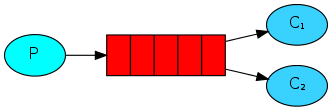
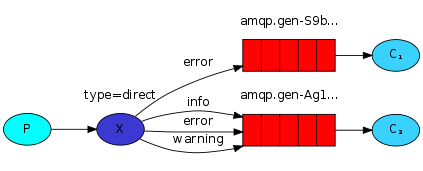
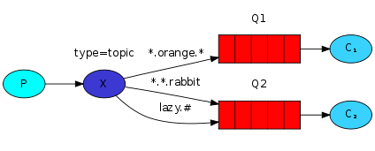

## rabbitmq八种模式

### 1. 简单队列模式

描述: 一个生产者, 一个消费者, 两者从同一个队列生产和消费消息.

生产者:
* 创建连接: `amqp.Dial()`, 指定连接参数
* 创建通道: `Connection.Channel()`
* 声明队列: `Channel.QueueDeclare()`, 指定队列名称和其他参数
* 发送消息: `Channel.Publish()`, exchange为空(rabbitmq内部使用默认交换器), routingKey为队列名称
* 关闭通道: `Channel.Close()`
* 关闭连接: `Connection.Close()`

消费者:
* 创建连接: `amqp.Dial()`, 指定连接参数
* 创建通道: `Connection.Channel()`
* 声明队列: `Channel.QueueDeclare()`, 指定队列名称和其他参数
* 接收消息: `Channel.Consume()`, 指定队列名称和其他参数 
* 关闭通道: `Channel.Close()`
* 关闭连接: `Connection.Close()`

### 2. 工作队列模式 

描述: 工作队列模式与简单模式队列的区别在于多个消费者从同一个队列消费消息, 两者消费的消息是不重复的而是整个队列所有消息的子集. 其支持两种调度: 轮询调度和公平调度

#### 2.1 轮询调度
轮询调度: 如果有2个消费者, 则忽略两者消费消息的效率, 分别固定消费一半的消息.

代码配置与简单队列模式一样:
* 生产者和消费者的队列声明, 使用同一个队列名称
* 生产者发送消息, exchange为空(rabbitmq内部使用默认交换器), routingKey为队列名称
* 消费者接收消息, 指定消费的队列名称

#### 2.2 公平调度
公平调度: 如果有2个消费者, 则基于两者消费消息的效率, 效率高的多消费, 效率低的少消费.

代码配置与轮询调度区别:
* 消费者接收消息配置`autoAck`值为false
* 消费者消费完一条消息后调用`Delivery.Ack`方法手动提交ack
* 消费者通过`Qos()`方法设置在服务器收到ack之前为消费者保留的消息数

### 3. fanout队列模式

描述: fanout队列模式, 相比较简单和工作队列模式, 区别在于生产者消息是发送给交换器exchange, 而不是直接发送给队列queue. 
* 此时queue和exchange需要做绑定操作, 而routingKey可以指定也可以是空字符串.
* 如果一个exchange绑定多个queue, 那么生产者向exchange发送一条消息, 所有绑定的queue都降接收到消息

生产者:
* 声明exchange,
* 发送消息, 设置exchange交换器名称, routingKey路由key和其他参数.

消费者:
* 声明exchange
* 声明queue
* 绑定exchange, queue和routingKey
* 从队列接收消息

### 4. direct队列模式

描述: direct队列模式, 与fanout模式区别在于可以将多个routingKey绑定到一个queue, 也可以将一个routingKey绑定到多个queue.

生产者:
* 声明exchange, type为direct
* 发送消息, 指定routingKey

消费者:
* 声明exchange, type为direct
* 绑定exchange, queue和routingKey

### 5. topic队列模式

描述: topic队列模式, 相比direct模式区别在于routingKey支持模糊匹配, 不再是绝对匹配.
* `*` 表示匹配一个单词
* `#` 表示匹配零个/一个或多个单词

生产者:
* 声明exchange, type为topic
* 发送消息, 指定routingKey

消费者:
* 声明exchange, type为topic
* 绑定exchange, queue和routingKey

### 6. header队列模式

描述: header队列模式, 相比direct模式区别在于routingKey可以为空字符串, 并且queue和exchange的匹配是基于header参数匹配. (只有发送消息的header包括绑定策略的所有设定header才算匹配)

生产者:
* 声明exchange, type为header
* 发送消息, 指定routingKey和header

消费者:
* 声明exchange, type为header
* 绑定exchange, queue, routingKey和header

### 7. rpc队列模式 TODO
### 8. publisher confirm队列模式 TODO